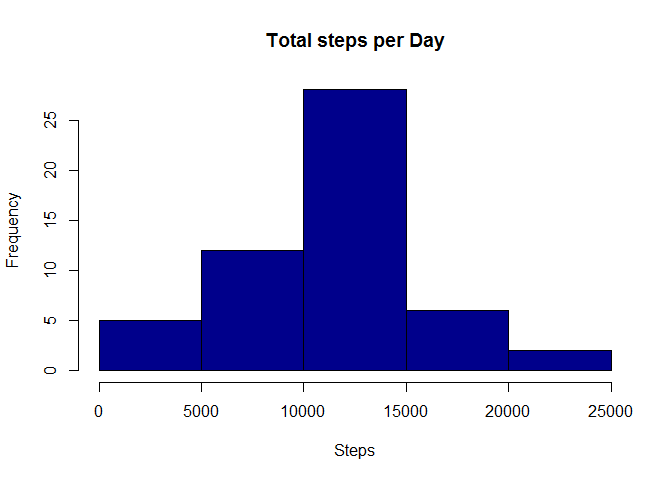
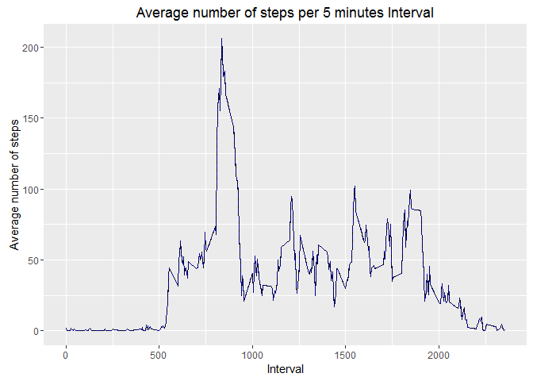
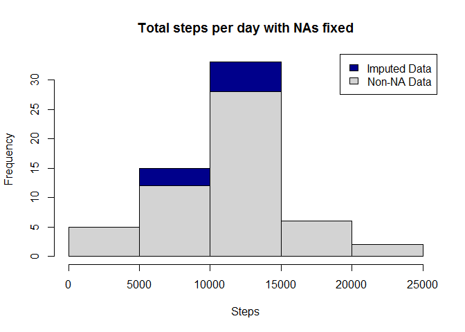
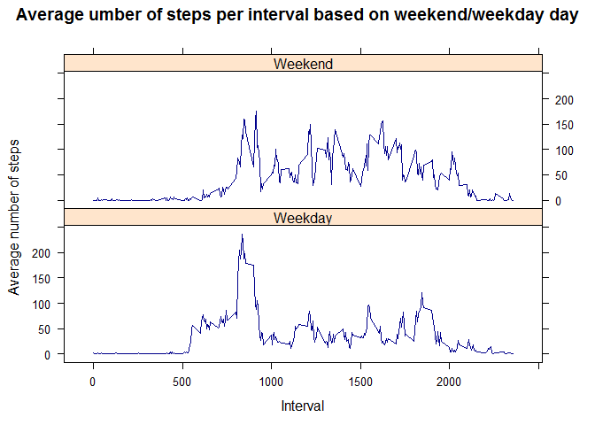

# PA1_template.md


Loading all libraries I need


```r
library(ggplot2)
```

```
## Warning: package 'ggplot2' was built under R version 3.2.5
```

```r
library(plyr)
```

```
## Warning: package 'plyr' was built under R version 3.2.5
```

```r
library(ggplot2)
library(lattice) 
```

#1. Loading and preprocessing the data


```r
activity <- read.csv("C:\\Users\\sanja.DESKTOP-0T6TAAG\\Desktop\\Data\\activity.csv")
```
### Processing and cleaning data without nas


```r
activity$day <- weekdays(as.Date(activity$date))
activity$DateTime<- as.POSIXct(activity$date, format="%Y-%m-%d")
clean <- activity[!is.na(activity$steps),]
```

# 2. What is mean total number of steps taken per day?


```r
sumTable <- aggregate(activity$steps ~ activity$date, FUN=sum, )
colnames(sumTable)<- c("Date", "Steps")
```

Histogram of total steps per day


```r
hist(sumTable$Steps, xlab="Steps", main = "Total steps per Day", col = "darkblue")
```

<!-- -->

Calculate the mean and median of the total number of steps taken per day

Mean of steps

```r
as.integer(mean(sumTable$Steps))
```

```
## [1] 10766
```
Median of steps

```r
as.integer(median(sumTable$Steps))
```

```
## [1] 10765
```

#3. What is the average daily activity pattern?

First, create average number of steps per interval


```r
intervalTable <- ddply(clean, .(interval), summarize, Avg = mean(steps))
```

Create line plot of average number of steps per interval


```r
p <- ggplot(intervalTable, aes(x=interval, y=Avg), xlab = "Interval", ylab="Average Number of Steps")
p + geom_line()+xlab("Interval")+ylab("Average number of steps")+ggtitle("Average number of steps per 5 minutes Interval") + geom_line(linetype = 5, color = "darkblue")
```

<!-- -->

Which 5-minute interval, on average across all the days in the dataset, contains the maximum number of steps?


```r
maxSteps <- max(intervalTable$Avg)
intervalTable[intervalTable$Avg==maxSteps,1]
```

```
## [1] 835
```


#4. Imputing missing values

Number of NAs in original data set

```r
nrow(activity[is.na(activity$steps),])
```

```
## [1] 2304
```
Strategy for filling in NAs is to substitute the missing steps with the average 5-minute interval based on the day of the week.

Create the average number of steps per weekday and interval

```r
avgTable <- ddply(clean, .(interval, day), summarize, Avg = mean(steps))
```
Create dataset with all NAs for substitution

```r
nadata<- activity[is.na(activity$steps),]
```
Merge NA data with average weekday interval for substitution

```r
newdata<-merge(nadata, avgTable, by=c("interval", "day"))
```
Create a new dataset that is equal to the original dataset but with the missing data filled in.
Reorder the new substituded data in the same format as clean data set

```r
newdata2<- newdata[,c(6,4,1,2,5)]
colnames(newdata2)<- c("steps", "date", "interval", "day", "DateTime")
```
Merge the NA averages and non NA data together

```r
mergeData <- rbind(clean, newdata2)
```
Make a histogram of the total number of steps taken each day and Calculate and report the mean and median total number of steps taken per day. Do these values differ from the estimates from the first part of the assignment? What is the impact of imputing missing data on the estimates of the total daily number of steps?
Create sum of steps per date to compare with step 1


```r
sumTable2 <- aggregate(mergeData$steps ~ mergeData$date, FUN=sum )
colnames(sumTable2)<- c("Date", "Steps")
```

Mean of Steps with NA data taken care of

```r
as.integer(mean(sumTable2$Steps))
```

```
## [1] 10821
```
Median of steps with NA data taken care of

```r
as.integer(median(sumTable2$Steps))
```

```
## [1] 11015
```
 Creating the histogram of total steps per day, categorized by data set to show impact

```r
hist(sumTable2$Steps, breaks=5, xlab="Steps", main = "Total steps per day with NAs fixed", col="darkblue")
hist(sumTable$Steps, breaks=5, xlab="Steps", main = "Total steps per day with NAs fixed", col="lightgrey", add=T)
legend("topright", c("Imputed Data", "Non-NA Data"), fill=c("darkblue", "lightgrey") )
```

<!-- -->


#5. Are there differences in activity patterns between weekdays and weekends?

First, create new category based on the days of the week

```r
mergeData$DayCategory <- ifelse(mergeData$day %in% c("Saturday", "Sunday"), "Weekend", "Weekday")
```
Make a panel plot containing a time series plot (i.e. type = "l") of the 5-minute interval (x-axis) and the average number of steps taken, averaged across all weekday days or weekend days (y-axis).
Summarize data by interval and type of day

```r
intervalTable2 <- ddply(mergeData, .(interval, DayCategory), summarize, Avg = mean(steps))
```
Plot data in a panel plot

```r
xyplot(Avg~interval|DayCategory, data=intervalTable2, type="l",  layout = c(1,2),
       main="Average umber of steps per interval based on weekend/weekday day", 
       ylab="Average number of steps", xlab="Interval", col = "darkblue")
```

<!-- -->

